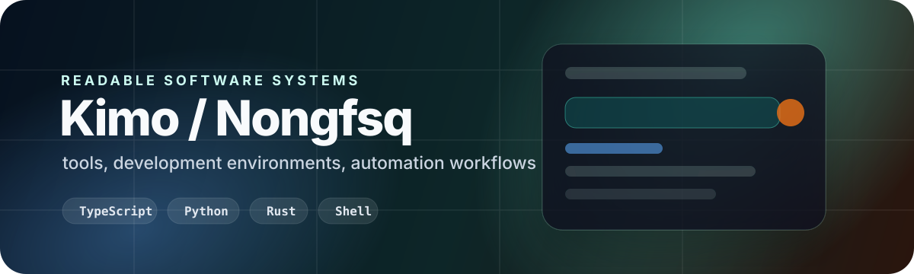

  

## Systems I Build

I build readable tools, development environments, and focused software systems. My work usually sits close to daily workflows: editor setup, language and dictionary tooling, local automation, translation/research pipelines, and small applications that solve specific problems.

Much of the applied work is private. This profile shows the public pieces, the technical shape of the work, and the navigation routes I use to keep projects discoverable.

| Area | What it includes |
| --- | --- |
| **Product systems** | TypeScript-heavy private applications, desktop/web experiments, and workflow-first product code. |
| **Language tooling** | Dictionary interfaces, input-method experiments, structured text workflows, and translation utilities. |
| **Developer environment** | Neovim/LazyVim, shell configuration, terminal migration, and readable editor ergonomics. |
| **Automation workflows** | Python, Rust, PowerShell, GitHub CLI, Codex workflows, and local integration scripts. |
| **Research tooling** | Archive utilities, EPUB processing, translation support, and structured research notes. |
| **Learning systems** | C++, TypeScript, data structures, and coursework repositories kept for reference. |

## Current Work

| Track | Focus | Stack |
| --- | --- | --- |
| **Readable environments** | Make editor, shell, and input workflows easier to understand and restore. | Lua · Shell · Python |
| **Language tools** | Build private dictionary and text-processing workflows around structured language data. | TypeScript · Tauri · Python |
| **Automation** | Connect local tools, GitHub workflows, and repeatable agent routines. | Python · Rust · PowerShell |
| **Research systems** | Turn translation, EPUB, and archive work into durable local tooling. | Python · JavaScript |
| **Small applications** | Build focused apps, monitors, and websites around concrete personal or operational needs. | TypeScript · HTML · Vue |

## Public Projects

<table>
  <tr>
    <td width="50%">
      <a href="https://github.com/Nongfsq/clarity_lazyvim">
        <strong>clarity_lazyvim</strong>
      </a>
       
      Accessible LazyVim configuration focused on readability, contrast, and long-session comfort.
       
      Lua · public template · editor environment
    </td>
    <td width="50%">
      <a href="https://github.com/Nongfsq/pi-monitor">
        <strong>pi-monitor</strong>
      </a>
       
      Raspberry Pi website monitoring with RGB LED status and a small web interface.
       
      Python · Raspberry Pi · monitoring
    </td>
  </tr>
  <tr>
    <td width="50%">
      <a href="https://github.com/Nongfsq/zsh_config">
        <strong>zsh_config</strong>
      </a>
       
      Shell and Zsh configuration files for a portable, recoverable command-line setup.
       
      Shell · configuration · development environment
    </td>
    <td width="50%">
      <a href="https://github.com/Nongfsq/codex-custom-model-picker-repair">
        <strong>codex-custom-model-picker-repair</strong>
      </a>
       
      PowerShell repair tooling for Codex model picker configuration.
       
      PowerShell · Codex tooling · repair script
    </td>
  </tr>
</table>

## Repository Navigation

These links use GitHub search and topics as a lightweight project map. Public visitors see public repositories; signed-in access may show more depending on permissions.

| Route | Opens |
| --- | --- |
| [Recently active work](https://github.com/search?q=user%3ANongfsq+topic%3Aactive&type=repositories&s=updated&o=desc) | Repositories tagged as active, sorted by recent movement. |
| [Product systems](https://github.com/search?q=user%3ANongfsq+topic%3Aprivate-product&type=repositories&s=updated&o=desc) | Private product and standalone application work. |
| [Applications](https://github.com/search?q=user%3ANongfsq+topic%3Aapps&type=repositories&s=updated&o=desc) | Websites, desktop tools, dictionary work, and monitoring projects. |
| [Developer environment](https://github.com/search?q=user%3ANongfsq+topic%3Adev-environment&type=repositories&s=updated&o=desc) | Editor, shell, terminal, and input-method repositories. |
| [Automation tooling](https://github.com/search?q=user%3ANongfsq+topic%3Apersonal-tooling&type=repositories&s=updated&o=desc) | Codex workflows, repair tools, bridges, and local automation. |
| [Research and writing](https://github.com/search?q=user%3ANongfsq+topic%3Aresearch-writing&type=repositories&s=updated&o=desc) | Archive, EPUB, translation, and structured research tools. |

## Technical Focus

  
  
  
  
  
  
  

| Layer | Tools and domains |
| --- | --- |
| **Application development** | TypeScript, Tauri, Vue, HTML, web APIs, focused desktop/web tools. |
| **Automation and systems** | Python, Rust, PowerShell, GitHub CLI, local scripts, workflow repair utilities. |
| **Development environment** | Neovim, LazyVim, Zsh, shell tooling, terminal migration, Rime/input-method work. |
| **Text and research workflows** | Dictionaries, EPUB processing, translation tooling, archive workflows, structured notes. |
| **Hardware and monitoring** | Raspberry Pi, status LEDs, URL monitoring, small operational dashboards. |

## Working Principles

- Build tools that can be reopened and understood months later.
- Prefer readable configuration over clever configuration.
- Keep public projects useful and private work appropriately private.
- Turn repeated manual work into durable automation.
- Treat the development environment as part of the software system.

`readable tools` · `development environments` · `research workflows`

