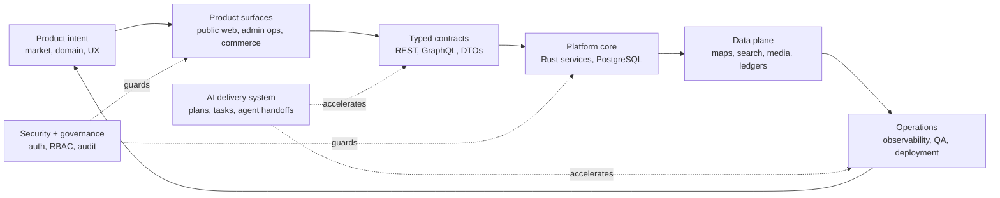
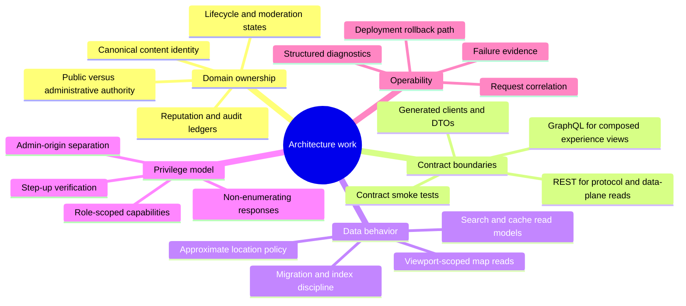
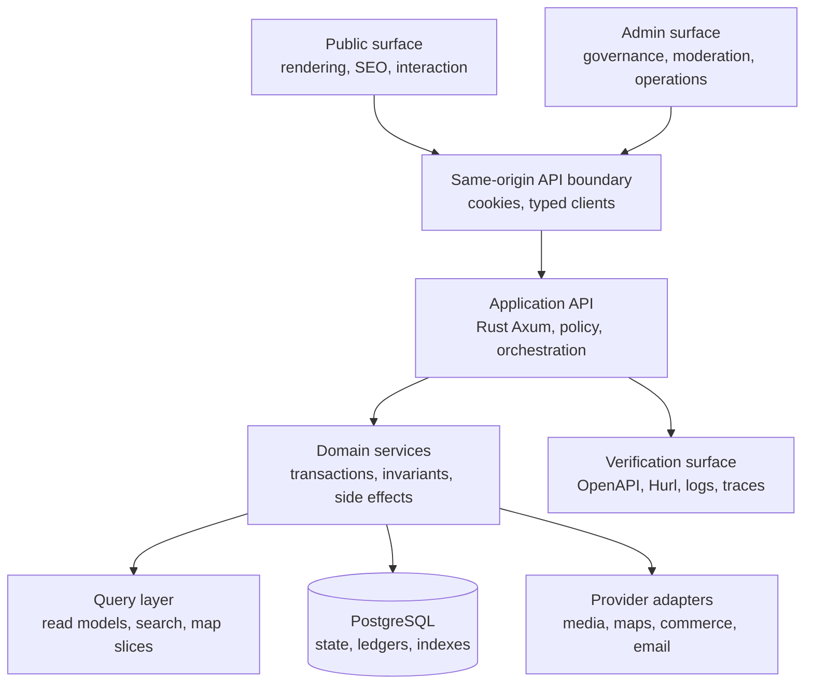
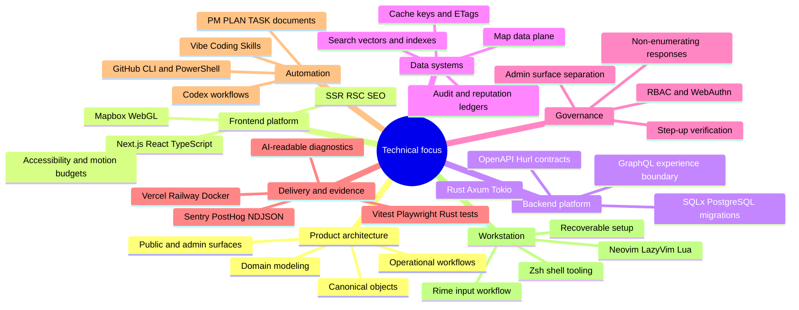

## Systems I Build

I build private product systems where product design, platform architecture, data governance, security, delivery, and AI-assisted execution are treated as one coordinated delivery system.

## Current Work

Current work centers on a private production system. I keep the public description at the architecture level: domain ownership, API boundaries, data behavior, privilege separation, and the evidence needed to operate changes safely.

Current architecture tracks: contract design, domain-service boundaries, map read-model behavior, role-scoped governance, provider isolation, observability events, and repeatable verification.

## Public Workbench

Small public pieces from my own workbench: configs, repair scripts, monitors, and experiments that were useful enough to keep outside private systems. Not the main body of work, but usually practical.

<table>
  <tr>
    <td width="50%">
      <a href="https://github.com/Nongfsq/clarity_lazyvim">
        <strong>clarity_lazyvim</strong>
      </a>
       
      Accessible LazyVim configuration focused on readability, contrast, and long-session comfort.
       
      Lua · public template · editor environment
    </td>
    <td width="50%">
      <a href="https://github.com/Nongfsq/pi-monitor">
        <strong>pi-monitor</strong>
      </a>
       
      Raspberry Pi website monitoring with RGB LED status and a small web interface.
       
      Python · Raspberry Pi · monitoring
    </td>
  </tr>
  <tr>
    <td width="50%">
      <a href="https://github.com/Nongfsq/zsh_config">
        <strong>zsh_config</strong>
      </a>
       
      Shell and Zsh configuration files for a portable, recoverable command-line setup.
       
      Shell · configuration · development environment
    </td>
    <td width="50%">
      <a href="https://github.com/Nongfsq/codex-custom-model-picker-repair">
        <strong>codex-custom-model-picker-repair</strong>
      </a>
       
      PowerShell repair tooling for Codex model picker configuration.
       
      PowerShell · Codex tooling · repair script
    </td>
  </tr>
</table>

## Technical Focus

  
  
  
  
  
  
  
  
  
  
  
  
  
  
  
  
  
  
  
  
  
  
  
  
  
  
  
  
  
  
  
  
  
  
  

  <em>Plot twist: none of the above matters. Just learn <strong>Vibe Coding</strong>.</em>

## Operating Standard

| Product | Architecture | Delivery |
| --- | --- | --- |
| Own the product, domain model, public/admin split, and operational rules as one system. | Typed contracts, auditable data flows, permission boundaries, and observable failure evidence. | AI-assisted execution backed by PM plans, tests, diagnostics, and durable handoff artifacts. |

`readable systems` · `operable environments` · `research-grade workflows`

Product architecture, typed platforms, DevOps observability, media/data pipelines, and AI-assisted execution.

  <em>“Economics has always maintained that wealth emerges solely from production and services, and never originates from distribution.”</em> 
  Frank X.

