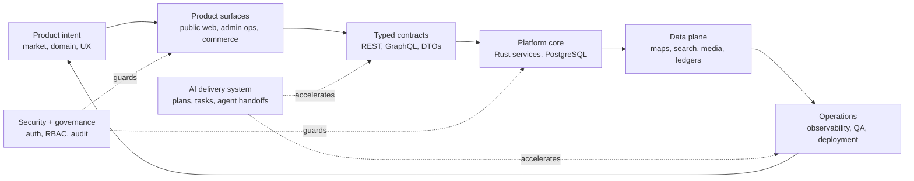
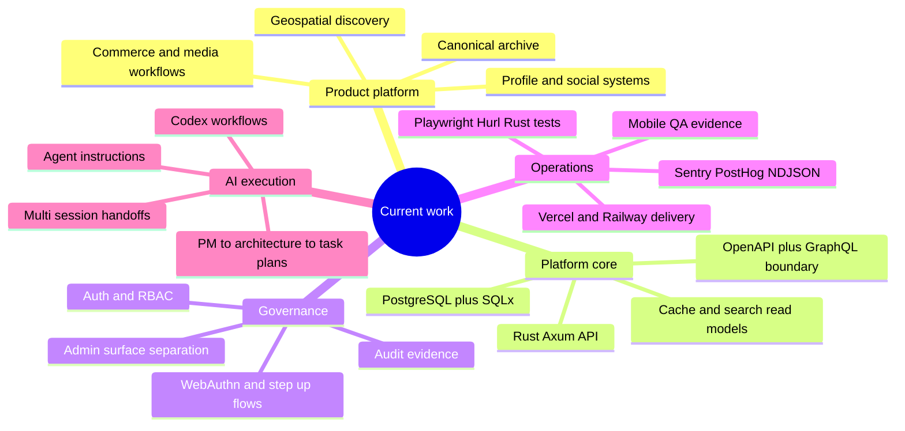
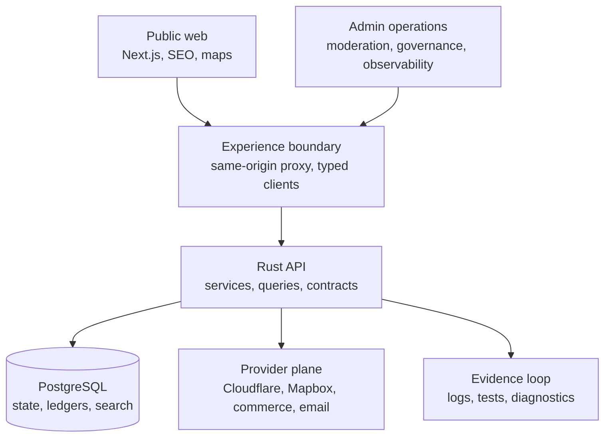

## Systems I Build

I build private, company-scale product systems where product design, platform architecture, data governance, security, delivery, and AI-assisted execution are treated as one operating system.

The public repositories are selected artifacts from a broader private engineering practice. The deeper work lives in integrated systems with public UX, dedicated admin operations, typed API boundaries, role-governed security, privacy-aware analytics, deployment discipline, and internal tooling designed to keep a serious product organization moving.

## Current Work

The current flagship work is a company-grade private product platform with geospatial discovery, canonical archives, profile and social systems, admin operations, reputation governance, hosted commerce, media workflows, and deployment discipline.

Current tracks: product-surface architecture, map data plane, API contracts, security governance, media pipeline, observability, QA evidence, and AI-assisted delivery infrastructure.

## Public Projects

Selected public artifacts from a broader private engineering practice.

<table>
  <tr>
    <td width="50%">
      <a href="https://github.com/Nongfsq/clarity_lazyvim">
        <strong>clarity_lazyvim</strong>
      </a>
       
      Accessible LazyVim configuration focused on readability, contrast, and long-session comfort.
       
      Lua · public template · editor environment
    </td>
    <td width="50%">
      <a href="https://github.com/Nongfsq/pi-monitor">
        <strong>pi-monitor</strong>
      </a>
       
      Raspberry Pi website monitoring with RGB LED status and a small web interface.
       
      Python · Raspberry Pi · monitoring
    </td>
  </tr>
  <tr>
    <td width="50%">
      <a href="https://github.com/Nongfsq/zsh_config">
        <strong>zsh_config</strong>
      </a>
       
      Shell and Zsh configuration files for a portable, recoverable command-line setup.
       
      Shell · configuration · development environment
    </td>
    <td width="50%">
      <a href="https://github.com/Nongfsq/codex-custom-model-picker-repair">
        <strong>codex-custom-model-picker-repair</strong>
      </a>
       
      PowerShell repair tooling for Codex model picker configuration.
       
      PowerShell · Codex tooling · repair script
    </td>
  </tr>
</table>

## Technical Focus

  
  
  
  
  
  
  
  
  
  
  
  
  
  
  
  
  
  
  
  
  
  
  
  
  
  
  
  
  
  
  
  
  
  
  

| Layer | Tools and domains |
| --- | --- |
| **Product and systems architecture** | Independent product ownership, domain modeling, canonical content objects, public/admin surfaces, permissions, governance, SEO, commerce boundaries, and operational workflows. |
| **Frontend platform** | Next.js, React, TypeScript, SSR/RSC, Tailwind, shadcn/ui, Framer Motion, Mapbox/WebGL, TanStack Query, Zustand, accessibility, and premium interaction design. |
| **Backend platform** | Rust, Axum, Tokio, SQLx, PostgreSQL, migrations, auth/RBAC, OpenAPI, Hurl, GraphQL Experience API planning, service/query layering, and typed contracts. |
| **Data and scale** | Map Data Plane, cache keys, request coalescing, ETags, search vectors, indexing, audit/reputation ledgers, large-data processing, structured archives, dictionary data, and media metadata pipelines. |
| **Security and governance** | WebAuthn/passkeys, elevated verification, admin-surface separation, role-scope visibility, high-privilege guardrails, non-enumerating responses, and audit evidence. |
| **DevOps and observability** | Vercel, Railway, Docker, GitHub Actions, Sentry, PostHog, structured NDJSON logs, request tracing, diagnostic CLIs, deployment checks, and Windows-native local operations. |
| **Quality and verification** | Vitest/RTL, Playwright, Rust integration tests, Hurl contracts, OpenAPI type generation, Android mobile QA, privacy guardrails, and AI-readable diagnostic reports. |
| **Media and automation** | Python, Rust, PowerShell, FFmpeg-style media processing, image/video compression, YouTube/content workflows, object storage pipelines, and GitHub CLI automation. |
| **AI engineering** | Codex workflows, PM/PLAN/TASK documents, Vibe Coding Skills, agent rules, multi-session collaboration, instruction systems, branch/worktree protocols, and repeatable task handoff. |
| **Developer environment** | Neovim, LazyVim, Lua, Zsh, shell tooling, terminal migration, Rime/input-method work, and recoverable workstation setup. |

## Operating Standard

| Product | Architecture | Delivery |
| --- | --- | --- |
| Own the product, domain model, public/admin split, and operational rules as one system. | Typed contracts, auditable data flows, permission boundaries, and observable failure evidence. | AI-assisted execution backed by PM plans, tests, diagnostics, and durable handoff artifacts. |

`readable systems` · `operable environments` · `research-grade workflows`

Product architecture, typed platforms, DevOps observability, media/data pipelines, and AI-assisted execution.

  <em>“Economics has always maintained that wealth emerges solely from production and services, and never originates from distribution.”</em> 
  Frank X.

